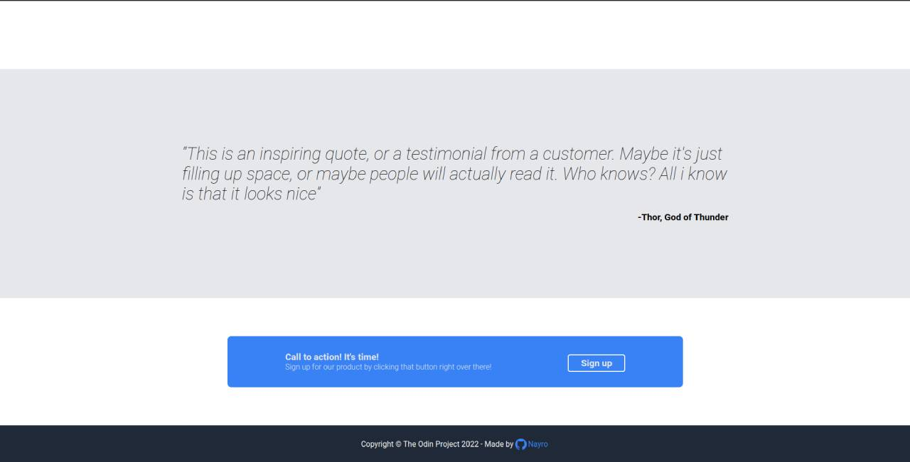

# landing-page

## About

A landing page for [the Odin Project](https://www.theodinproject.com/lessons/foundations-landing-page#assignment). The landing page use flex to display elements on the page.

## Live page

- [Landing page](https://github.com/NayroFr/landing-page/)

## Image credits

- [Bridge](https://unsplash.com/photos/Ssr26I0QWVY)

- [Face](https://thispersondoesnotexist.com/)

## Preview

